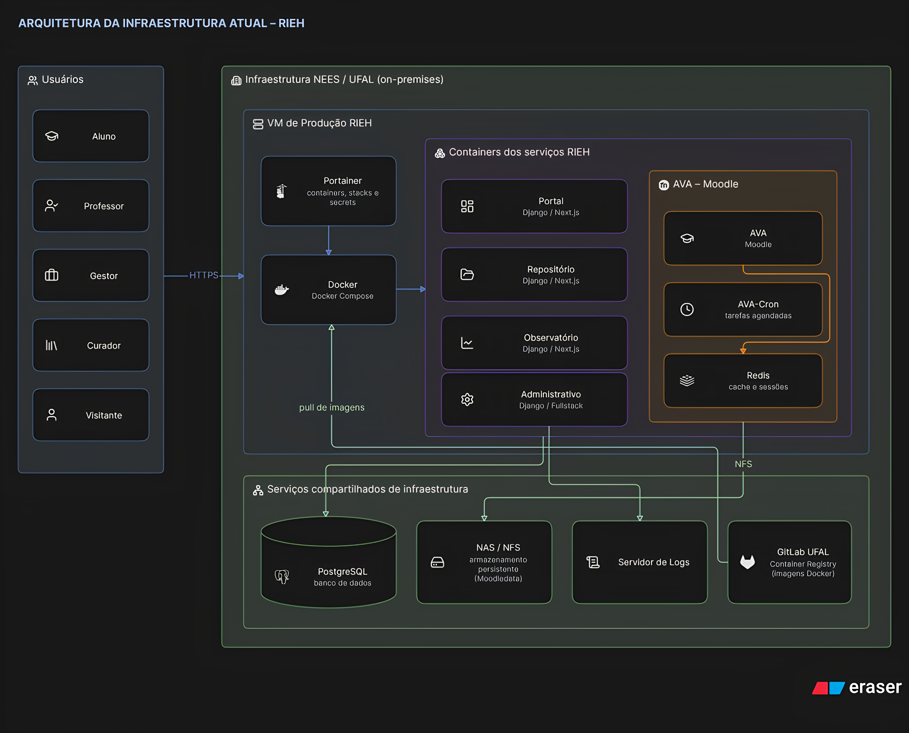

# Documentação de Arquitetura de Infraestrutura Atual — RIEH

**Visão Geral:** Infraestrutura local hospedada no ambiente do **NEES/UFAL**, baseada em máquinas virtuais, containers Docker e gerenciamento através do Portainer. A arquitetura atual não utiliza Kubernetes em produção.

---

### 1. Perfis de Usuários (Acesso)

A plataforma RIEH atende diferentes atores do sistema:

* **Aluno**
* **Professor**
* **Gestor**
* **Curador**
* **Visitante**

Os usuários acessam os serviços do RIEH por meio da infraestrutura hospedada no ambiente do NEES/UFAL.

---

### 2. Infraestrutura e Gerenciamento

A camada principal de execução da aplicação é composta por uma **VM de Produção RIEH**, hospedada na infraestrutura do NEES/UFAL.

* **VM de Produção RIEH:** Ambiente responsável pela execução dos serviços de produção.

* **Docker / Docker Compose:** Responsável pela execução dos serviços da aplicação em containers.

* **Portainer:** Interface de gerenciamento utilizada para administrar os containers, stacks e recursos Docker da produção.

* **Docker Secrets:** Utilizado para armazenar e disponibilizar credenciais sensíveis aos containers, como credenciais de acesso ao banco de dados.

---

### 3. Serviços da Plataforma RIEH

Os sistemas da plataforma são executados como **containers Docker** dentro da infraestrutura de produção:

* **Portal:** Django / Next.js

* **AVA:** Moodle

* **Repositório:** Django / Next.js

* **Observatório:** Django / Next.js

* **Administrativo:** Django (Fullstack)

Diferentemente da arquitetura proposta em Kubernetes, os serviços da produção atual não são executados como Pods, mas diretamente como containers Docker gerenciados pelo Portainer.

#### **Componentes do AVA**

O AVA possui componentes adicionais para seu funcionamento:

* **AVA:** Container principal do Moodle/Apache.

* **AVA-Cron:** Container responsável pela execução das tarefas agendadas do Moodle.

* **Redis:** Utilizado pelo AVA para cache e gerenciamento de sessões.

---

### 4. Banco de Dados e Armazenamento

A infraestrutura utiliza serviços externos aos containers para persistência dos dados.

* **PostgreSQL:** Banco de dados utilizado pelos serviços da plataforma. O banco é executado separadamente dos containers de aplicação.

* **NAS / NFS:** Armazenamento compartilhado utilizado para dados persistentes. No AVA, o armazenamento do `moodledata` é disponibilizado através de NFS.

O **AVA** e o **AVA-Cron** utilizam o armazenamento compartilhado para persistência dos arquivos do Moodle.

---

### 5. Imagens e Implantação dos Containers

* **GitLab UFAL / Container Registry:** Responsável pelo armazenamento das imagens Docker utilizadas pelos serviços RIEH.

* **Docker:** Obtém as imagens disponibilizadas no Container Registry para execução dos serviços na VM de produção.

O fluxo de implantação pode ser representado como:

**GitLab Container Registry → Docker → Containers RIEH**

O **Portainer** é utilizado para gerenciamento da execução dos containers e das stacks em produção.

---

### 6. Logs e Monitoramento

A infraestrutura possui um mecanismo centralizado para recebimento dos logs dos containers:

* **Servidor de Logs:** Recebe os registros gerados pelos serviços da aplicação.

* **GELF:** Os containers enviam seus logs para o servidor utilizando o protocolo/formato GELF.

Fluxo:

**Containers RIEH → GELF → Servidor de Logs**

---

### 7. Características da Arquitetura Atual

* **Infraestrutura Local:** Hospedada no ambiente do NEES/UFAL, sem dependência direta de serviços AWS.

* **Execução em Containers:** Os serviços de produção são executados utilizando Docker.

* **Gerenciamento Centralizado:** O Portainer fornece o gerenciamento dos containers, stacks e Docker Secrets.

* **Persistência Externa:** Banco de dados PostgreSQL e armazenamento NAS/NFS são mantidos fora dos containers de aplicação.

* **Cache e Sessões:** O Redis é utilizado pelo AVA para armazenamento temporário e gerenciamento de sessões.

* **Registro de Imagens:** As imagens Docker são armazenadas no GitLab Container Registry.

* **Centralização de Logs:** Os containers encaminham logs para um servidor externo através de GELF.

* **Kubernetes apenas como Piloto:** Kubernetes não faz parte do ambiente de produção atual.

---

## Pipelines

**AVA**

* **Imagem Docker Base / Construção:** Constrói a imagem principal utilizando um Dockerfile padrão na raiz (`docker-build`), com suporte a variáveis de autenticação (`GIT_USER`, `GIT_KEY`) e varredura de contêineres (`container_scanning`).

* **Comportamento e Deploys:** Possui múltiplos gatilhos de deploy voltados para homologações estaduais e produção (`deploy-to-hmg`, `deploy-to-prod`, `deploy-to-hmg-estados`, `deploy-to-prod-ac`, `deploy-to-prod-to`) utilizando webhooks específicos do Portainer para a aplicação e para o serviço de cron (`$GITLAB_PORTAINER_WEBHOOK` e `$GITLAB_PORTAINER_WEBHOOK_CRON`).

**Portal**

* **Imagem Docker Base / Construção:** Utiliza imagens base Node.js (com tags configuráveis como `20.12.2` ou `20.3`) através de arquivos de build específicos como `Dockerfile.deploy`.

* **Comportamento e Deploys:** Executa estágios de validação, testes com SonarQube e SAST, integrando-se opcionalmente com atualizações via Helm Charts e Agentes do Kubernetes (`gitlab-agent-for-kubernetes`) ou webhooks tradicionais para os ambientes de homologação e produção (`deploy-to-hmg`, `deploy-to-prod`).

**Observatorio**

* **Imagem Docker Base / Construção:** Configurado com stacks de frontend/Node.js integradas a templates de qualidade de código do NEES e escaneamento de vulnerabilidades (`container_scanning`).

* **Comportamento e Deploys:** Aciona pipelines direcionadas para branches de liberação (`develop_release` ou `homologacao`) e branch padrão (`main`), disparando webhooks do Portainer para atualizar o serviço correspondente no ambiente de destino.

**Administrativo**

* **Imagem Docker Base / Construção:** Arquitetura altamente modular dividida em múltiplos builds utilizando imagens separadas para Django (`docker-build-django` com `PYTHON_TAG_DOCKER_BUILD`) e Nginx (`docker-build-nginx` com `NGINX_TAG`).

* **Comportamento e Deploys:** Executa uma esteira rigorosa de validações de código e estilo (`flake8`, `ruff`, `prettier`, `django-check`, `django-migrations`), testes automatizados com banco PostgreSQL e Redis (`pytest` / `test-django-app`), e realiza o deploy segmentado chamando webhooks independentes para cada componente (como `$GITLAB_PORTAINER_WEBHOOK_DJANGO` e `$GITLAB_PORTAINER_WEBHOOK_NGINX`).