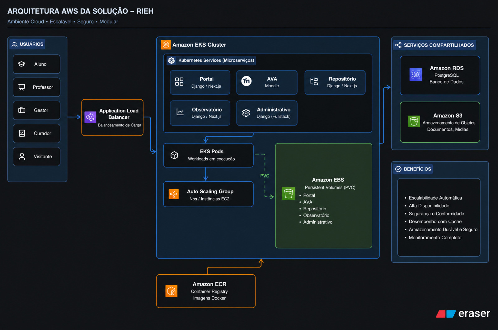

## Documentação de Arquitetura de Infraestrutura AWS — RIEH

**Visão Geral:** Ambiente Cloud de alta disponibilidade, escalável, seguro e modular para hospedagem da plataforma RIEH na AWS.

---

### 1. Perfis de Usuários (Acesso)

A entrada de tráfego na aplicação atende a diferentes atores do sistema:

* **Aluno**
* **Professor**
* **Gestor**
* **Curador**
* **Visitante**

---

### 2. Roteamento e Balanceamento de Carga

* **Application Load Balancer (ALB):** Atua como o ponto de entrada público HTTP/HTTPS. É responsável por distribuir as requisições de todos os perfis de usuários para os serviços e microserviços em execução no cluster Kubernetes.

---

### 3. Computação e Orquestração (Amazon EKS)

O núcleo de aplicação é executado em um cluster **Amazon EKS (Elastic Kubernetes Service)** composto por:

#### **A. Kubernetes Services (Microserviços)**

* **Portal:** Django / Next.js
* **AVA:** Moodle
* **Repositório:** Django / Next.js
* **Observatório:** Django / Next.js
* **Administrativo:** Django (Fullstack)

#### **B. Gestão de Nós e Workloads**

* **Auto Scaling Group (ASG):** Gerencia o provisionamento e o dimensionamento dinâmico das instâncias EC2 (nós do cluster) conforme a demanda de carga.
* **EKS Pods:** Unidades de execução onde os containers das aplicações rodam sobre a infraestrutura gerenciada pelo ASG.

---

### 4. Armazenamento e Imagens de Container

* **Amazon ECR (Elastic Container Registry):** Registrador privado de imagens Docker. O Auto Scaling Group/EKS obtém as imagens diretamente do ECR para implantação dos pods.
* **Amazon EBS (Elastic Block Store - Persistent Volumes PVC):** Armazenamento em bloco dedicado para persistência dos dados de estado dos pods. Atende via PVC a todos os microsserviços:
* Portal
* AVA
* Repositório
* Observatório
* Administrativo

---

### 5. Serviços Compartilhados (PaaS)

* **Amazon RDS (PostgreSQL):** Instância de banco de dados relacional gerenciada, utilizada de forma compartilhada para persistência dos microsserviços do ambiente.
* **Amazon S3 (Simple Storage Service):** Armazenamento de objetos para arquivos estáticos, mídias e documentos gerados ou consumidos pelas aplicações.

---

### 6. Benefícios Arquiteturais da Solução Target

* **Escalabilidade Automática:** Dimensionamento dinâmico de nós (ASG) e pods (HPA no K8s).
* **Alta Disponibilidade:** Separação de camadas (computação, banco de dados gerenciado e armazenamento persistente).
* **Segurança e Conformidade:** Isolamento de rede e gestão centralizada de acessos na AWS.
* **Desempenho com Cache:** Otimização de entrega de conteúdo para os microsserviços.
* **Armazenamento Durável e Seguro:** Dados distribuídos entre EBS (persistência rápida de Pod) e S3 (armazenamento estático ilimitado).
* **Monitoramento Completo:** Rastreabilidade dos recursos em execução no EKS e serviços correlatos.

